# nem-catapult-metadata-requirements-proposal
## Metadata namespace
The NEM concept of "namespace" should be enhanced with a prefix that can be used to register metadata properties.

As example, for identity purposes, the following namespace and prefix can be used:
* namespace: "defined-id"
* metadata-prefix: "d-id"

## Metadata properties within a metadata-namespace
There should be a NEM Catapult operation to define metadata properties within a metadata-namespace. 
Property names - the "keys" of a key/value pair - include the metadata-prefix.

For identity purposes, these two metadata-properties are useful:
> * "d-id:documentHash"
>  * "d-id:status"

## NEM metadata-namespace
A NEM metadata-namespace should be added for canonical metadata. The metadata-namespace prefix should be "nem".

## Conditions on a metadata property
There should be an operation to add (simple) conditions on a metadata property. 
These conditions should be on the NEM metadata-namespace as their purpose is to trigger business logic developed on the NEM Catapult blockchain.

This is a list of potential  NEM conditions:

> * **"nem:isRequired"**: A transaction will be triggered only of a metadata value is provided 
> * **"nem:isUnique"**: A transaction will be triggered if a metadata value is unique across all transactions containing the same metadata. This also means that if a new transaction contains the same metadata value, that new transaction will be blocked.
> * **"nem:mayBeEmpty"**: A transaction will be triggered if a metadata value is empty
> * **"nem:enumeration"**: A transaction will be triggered if a metadata value is one - and only one - of the enumeration values
    
The default value for the boolean types is "false" and no business logic will be executed.
The account holder that puts these conditions on a metadata property has the intention of using the business logic, so will set their value to "true".

## NEM Catapult account alias as metadata
The documentations on the upcoming COW NEM Catapult contains the concept of "account alias" (https://github.com/nemtech/nem2-docs/blob/cow/source/concepts/namespace.rst).

Such account alias can also be encoded as NEM metadata:
> **"nem:accountAlias"**

The account alias could be used for binding a DID with a NEM account.
Example: 
* Account SCVG35-ZSPMYP-L2POZQ-JGSVEG-RYOJ3V-BNIU3U-N2E6 
* "nem:accountAlias" ="did:defined:1BvBMSEYstWetqTFn5Au4m4GFg7xJaNVN2" (a valid DID).

Alternatively, if the registration of an account would allow metadata, a DID could be provided via metadata. In that case, it would be good to make this a "nem" metadata property:
>**"nem:did"**

Metadata conditions can be applied to the "nem:accountAlias" - or, alternatively on "nem:did" - to add a constraint, e.g. to make it unique, via the "nem:isUnique" condition. Using such condition, a value of a "nem:accountAlias" can only be used once, which is exactly the behavior that  is required for an identity property.

## Example of using conditions on identity metadata
The "d-id:documentHash" metadata property should have the following conditions:
* nem:isRequired=true
* nem:isUnique=true
* nem:mayBeEmpty=true

The "d-id:status" metadata property should have these conditions:
* nem:isRequired=true
* nem:enumeration=["created", "updated", "revoked"]

With these two metadata properties "d-id:documentHash" and "d-id:status" used on an instance of an "identity-doc" mosaic, we can support all DID operations (as described in https://w3c-ccg.github.io/did-spec/#did-operations), not on the actual DID Documents, but at least on the document hashes on the NEM Catapult blockchain.

## Summary of NEM Catapult operations for identity
The following 4 steps show all transaction steps for identity purpose:
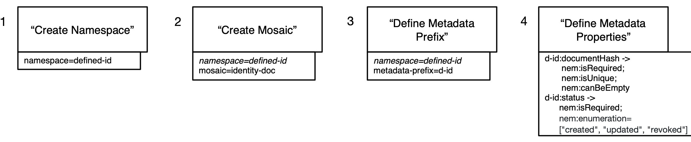

### Note on "update" and "revoked (or delete)" operation for identity management
Any blockchain struggles with the concept of mutability as it is contrary to the inherent immutability of a blockchain.
Off course a transaction remains immutable, but by adding some metadata and conditions, the concept of an "update" and "revocation (or delete)" can be implemented to a certain degree (needs to be in concert how an application reacts to that, unfortunately).

### Note on "verify" operation for identity management
A DID verify operation can look at all transactions with mosaic "identity-doc" coming from an account containing a DID as alias - or alternatively via "nem:did" metadata - and then can look at the "d-id:status" metadata. 
The last transaction will contain the status that the verifier should use.

## Conclusion on using metadata for identity purposes
Using the proposed metadata and conditions, we can modify the NEM Catapult blockchain so that becomes more suitable for identity purposes:
1. By attaching an alias to an account - or alternatively, via "nem:did" metadata -containing a DID and restricting this to be unique and
2. By using this account for transactions of mosaic "identity-doc" with metadata "d-id:documentHash" and "d-id:status" and respective conditions.

## Metadata for an oracle account
Putting an **oracle - a data source outside of a blockchain** - on the NEM Catapult is another strong use case in which metadata can play a role. To enforce the strength of an oracle data source, it should be issued by a trusted "identified" party (can be more parties, using co-signing).

Therefore such oracle account should contain an account alias with a DID (see higher).
This DID should be public and be the owner of a public Verifiable Claim (containing data that proves the identity of the oracle).

To indicate an account is an oracle account, we suggest adding this metadata to it:
 > **"nem:isOracleAccount"**
## Oracle example: LocalWind
### Context of the example
To demonstrate an oracle use case, we use the fictitious company "LocalWind".
LocalWind is a renewable electricity producer and wants to setup a NEM Catapult oracle as a mosaic and create a transaction every x time new electricity production data is available.
Then the creation of each instance of this electricity mosaic should trigger the creation of a number of electricity tokens that represent shareholder value.

LocalWind then has two mosaics (within the "localwind" namespace):
* localwind.electricity: This will be the **oracle**
* localwind.e-token: This will be the **(security) token** released based on the issuing of oracle data

### An oracle account for localwind.electricity
First thing that LocalWind needs to do is to create an oracle account with an account alias containing a LocalWind identity (DID).
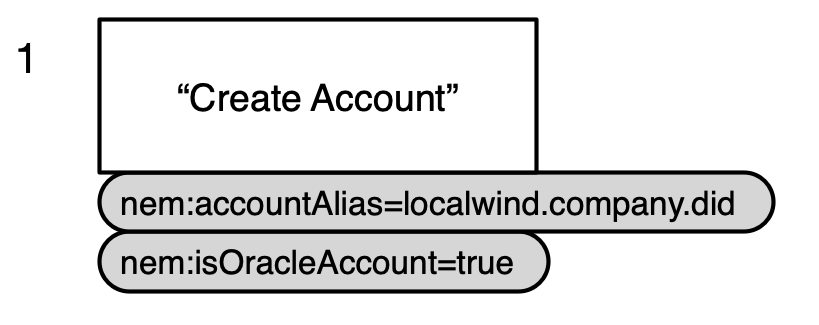
    
### Identity documents for the LocalWind company
An oracle account holder for LocalWind is the responsible/accountable entity behind the delivery of oracle data.
To proof the identity of the LocalWind company, a public DID Document and Verifiable Claim should be registered on a NEM Catapult.

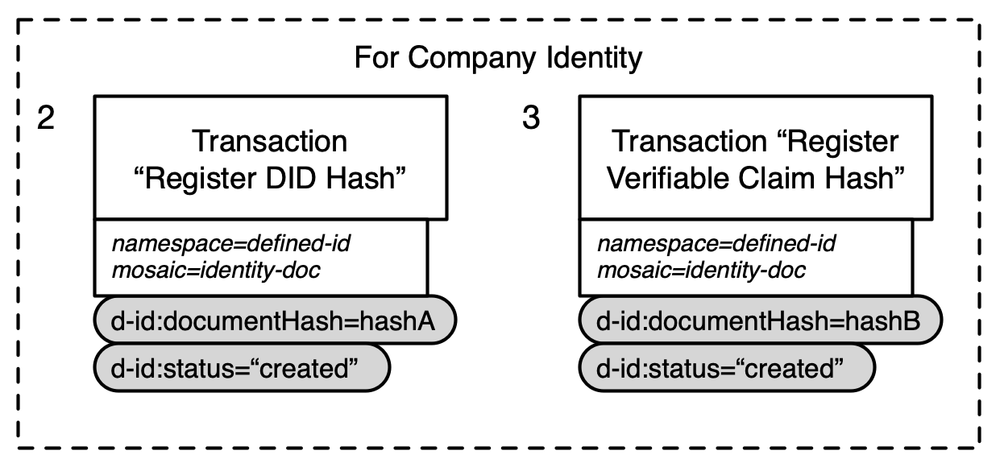

Additionally, the responsible persons behind LocalWind could also register/proof their identity this way and a link to their identity could then be added to the Verifiable Claim of the company.
    
### Metadata for the oracle and e-token mosaics
The "localwind.electricity" mosaic should bear additional metadata to make it useful for oracle purposes. We propose the following metadata property in the NEM namespace for this purpose:
> **"nem:isOracleMosaic"** (or "nem:isOracle")

The "localwind.electricity" mosaic should also contain metadata about the electricity generator and the data it produces at a certain time.

LocalWind should then register their metadata-prefix which they name "lwe". 
These are the "lwe" metadata properties:
>* **"lwe:generatorDID"**: Identifier of the electricity generator that created the data.
> * **"lwe:producedElectricity"**: The produced electricity 
>* **"lwe:generatorEventTime"**: The dateTime the electricity generator recorded the produced electricity.

These are the steps Localwind  should take to define their metadata:
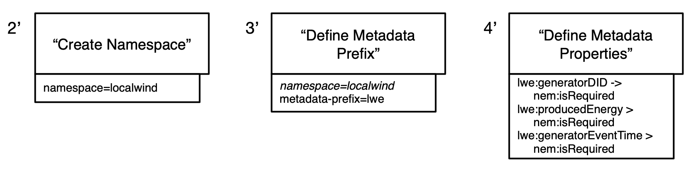

On the other hand, the ""localwind.e-token" mosaic" should have metadata to define **how e-tokens will be created** by the "localwind.electricity" oracle.

For that purpose, we suggest the following NEM Catapult metadata:
> * **"nem:oracleSource"**: Reference to the NEM Catapult oracle mosaic that triggers the issuance of another mosaic.
> * **"nem:oracleInput**: Reference to the metadata that is used as input for the issuance of another mosaic.
>* **"nem:oracleDivider"**: Formula that divides the input to issue mosaics

### Identity documents for the LocalWind energy generator (device)
The generator DID is a public DID of a device that is owned by Localwind. Localwind could re-use their oracle account to register the DID Document and Verifiable Claim as proof for this electricity generator device.

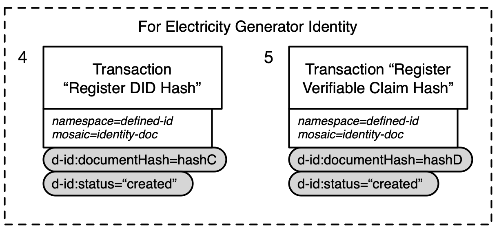

There is no personal data involved in these device and business identities, so there is no harm on publishing all this metadata publicly, on the contrary, it allows fully transparent discovery.

### Generic, descriptive, standard metadata
More metadata can be added to further describe both the "localwind.electricity" oracle mosaic and the "localwind.e-token" mosaic, so interested parties can understand what this token is about.
For that kind of purpose, standardised **Dublin Core** metadata should be used that is widely accepted.
That Dublin Core metadata uses the prefix "dc". More info about Dublin Core can be find here: http://www.dublincore.org/documents/dcmi-terms/

### LocalWind mosaic creation
Now with all metadata and identities in place, Localwind can create their mosaics:
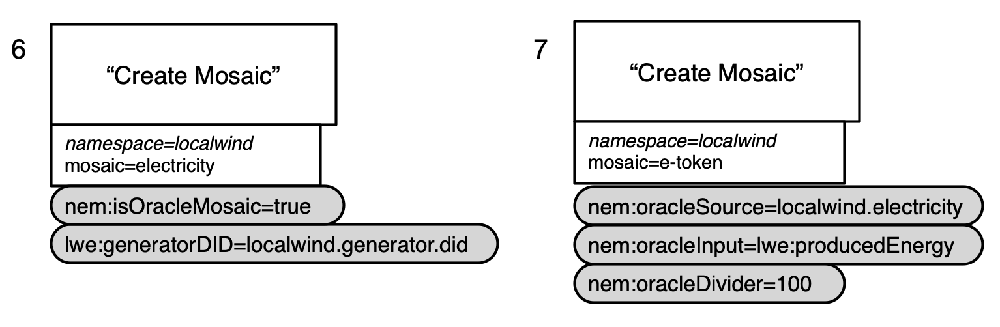

### Transactions with the Localwind mosaics
The transaction that creates an instance of a "localwind.electricity" oracle mosaic only needs to contain metadata values that are different for each transaction, being the "lwe:producedEnergy" and "lwe:generatorEventTime. 

To indicate which "localwind.electricity" transaction caused the creation of which "localwind.e-token" transaction, the following metadata property is proposed:
> **"nem:causingTransaction"**

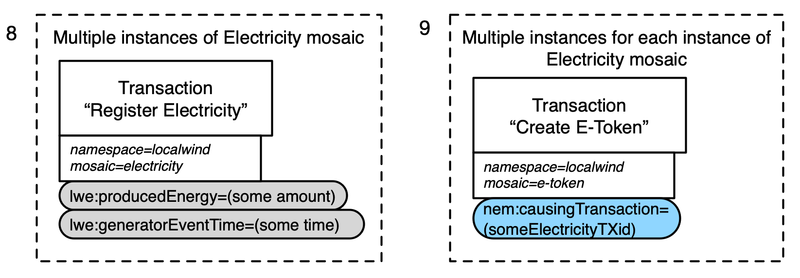

## General remark on NEM Catapult metadata
**To make all this metadata useful for discovery, it should be queryable.**

## First example extension for LocalWind: Stakeholders oracle via a KYC provider
The previous example can be extended to include a mechanism to determine the stakeholders for the e-token transactions.

These stakeholders should go through a KYC procedure, as the **e-token is very likely considered as a security**.

We can use the following mechanisms that have been demonstrated in the LocalWind example:
* Every stakeholder should have a "private" identity account.
* An external KYC provider can verify this stakeholder's private identity based on a Verifiable Claim that the stakeholder must share with the KYC provider.
* An external KYC provider can put the verified stakeholder on a "private" whitelist, issued by the KYC provider. This can be a (zero knowledge) Verifiable Claim. This whitelist will act as a KYC/stakeholder oracle and is bound to the e-token.
* The KYC provider should have an oracle account.
* The KYC provider can update the KYC/stakeholder oracle, if new stakeholders are added or existing need to be removed (for financial/legal reasons).
* All parties only need to create and register their identity documents only once, so creating new whitelists - bound to other security tokens - can be created very fast afterward (speeding-up the KYC procedure significantly).

To extend the LocalWind example with this KYC/stakeholder functionality, the following steps need to be taken:
* Create oracle account for KYC provider and identity accounts for all stakeholders
* Register identity documents for the KYC provider, the Whitelister and the stakeholders
* Update LocalWind metadata and update the e-token mosaic
* Create a new mosaic for the e-tokenwhitelist oracle

### Create oracle account for KYC provider and identity accounts for all stakeholders
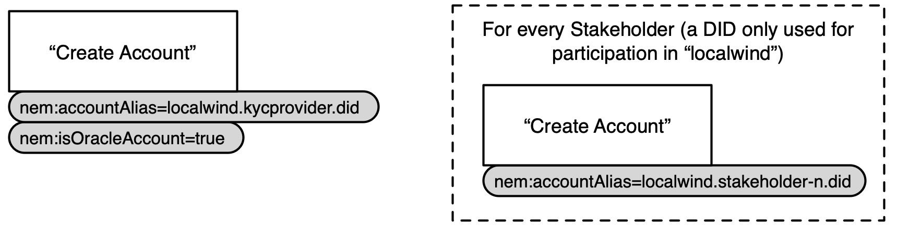

### Register identity documents for the KYC provider, the Whitelister and the stakeholders
Note that the whitelist data itself is here represented as a Verifiable Claim. The advantage is that this allows the KYC provider to cryptographically proof that he is the creator of the whitelist.
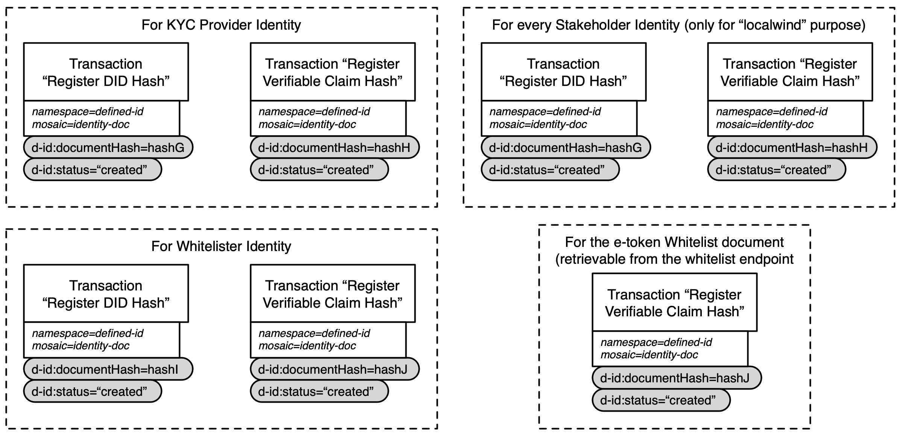

### Update LocalWind metadata and update the e-token mosaic
This extension shows that having multiple instances of the same metadata type is also useful. In our case, the e-token generation is based on two oracles: localwind.electricity and localwind.e-tokenwhitelist.

For whitelisting purposes, the following NEM Catapult metadata property are proposed:
> * **"nem:whitelistEndpoint"**: The endpoint where whitelist document (Verifiable Claim) can be retrieved
> * **"nem:whitelisterDID"**: The identity DID of the Whitelister

Important to notice - not shown in pictures - that the KYC provider needs to co-sign the e-token transactions.

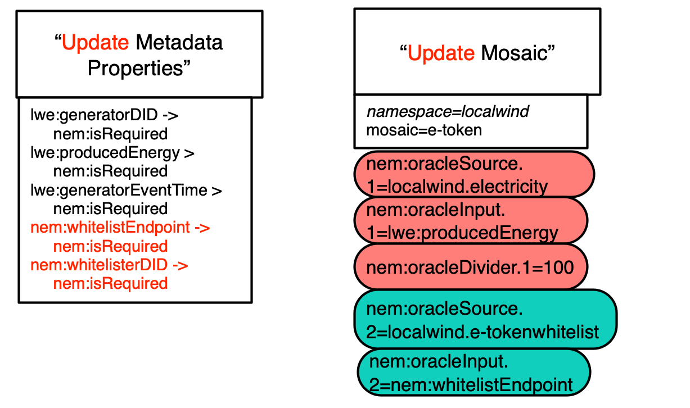

### Create a new mosaic for the e-tokenwhitelist oracle
The new element here is the metadata property "lwe:whitelistEndpoint" on the e-tokenwhitelist oracle that **points to an external document**. This is done for **privacy reasons** as the whitelist document can't be put on a blockchain, because it contains personal data (and this is against GDPR/EU Blockchain Forum recommendation).

The whitelist document should be encrypted by keys owned by the KYC provider and as he is co-signer he - and only he - should be able to use the whitelist document as input for the e-token transaction generation. (TBD how this could work in NEM Catapult).

The previous oracle, the LocalWind electricity oracle, didn't need this mechanism because no personal data was involved.

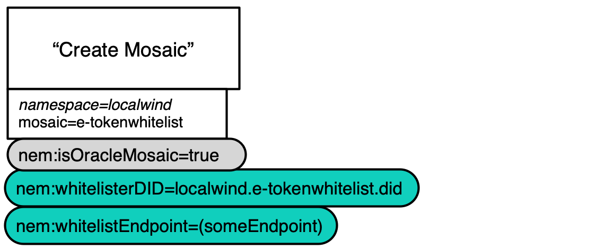

### Note on using oracles for public documentation
Public documentation will be required for security tokens, as this will **avoid information asymmetry**, to provide all (potential) stakeholder with the same information about the (security) token.

In that case, the public information can also be published via the oracle mechanism described above, but without encryption on the documentation. The oracle account holder can then proof ownership - and accountability - of the public documentation.

For these purposes, NEM could issue the following metadata property:
> **"nem:tokenDocumentationEndpoint"**: URL to public documentation about the token

## Second example extension for LocalWind: Exchange e-token to e-euro with validator/controller approval
The example can be further developed in which an extra series of steps are added to the workflow that **convert the e-token to an e-euro, including the approval - or rejection - of an external validator/controller.**
Off course this would be the same for any other non-cryptocurrency.

The release of an e-euro would include:
* The exchange rate that the issuer - electricity company - agrees on
* The approval from an external validator (co-signer) to allow the exchange

Furthermore, the issuing of the e-euro should trigger an external API - that is "listening" to e-euro transactions - to create a SEPA/EURO message (e.g. using Swift message) to **transfer Euros from the company SEPA/EURO account to the accounts of the electricity stakeholders**.
This part is not worked out in this example.

If no conversion to non-cryptocurrency is needed, then the role of validator/controller is still needed for the e-token, as
this role has the power to block the spending of the e-token. This is required for a number of legal reasons (e.g. compliance to a certain security token regulation, fraud, court order, etc.).
This is a very unpopular role in the current cryptocurrency world, as it is there to take the power away from the token holder, but it is a securities reality/requirement today.
